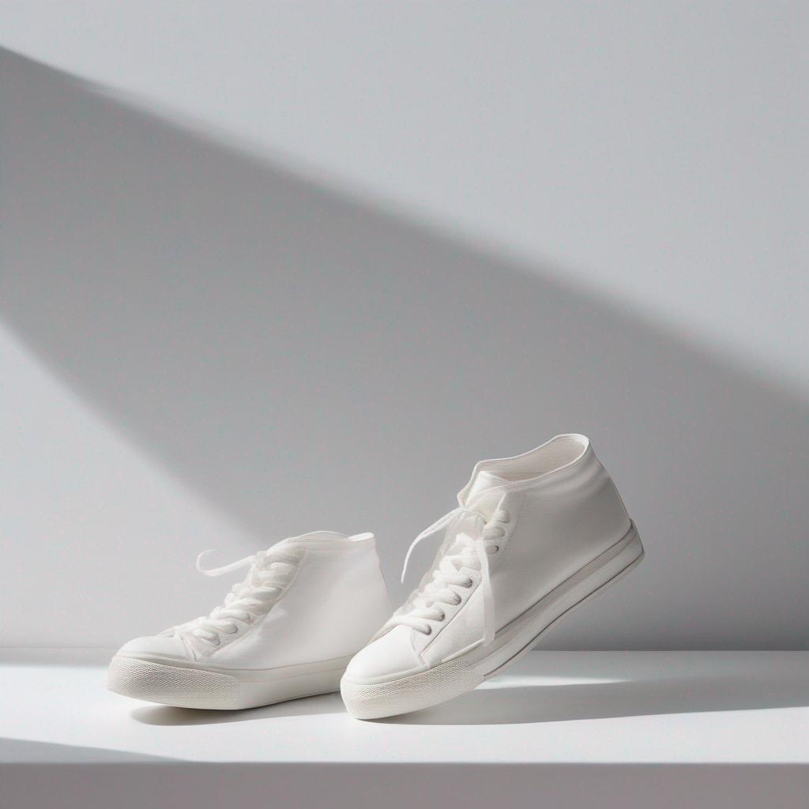
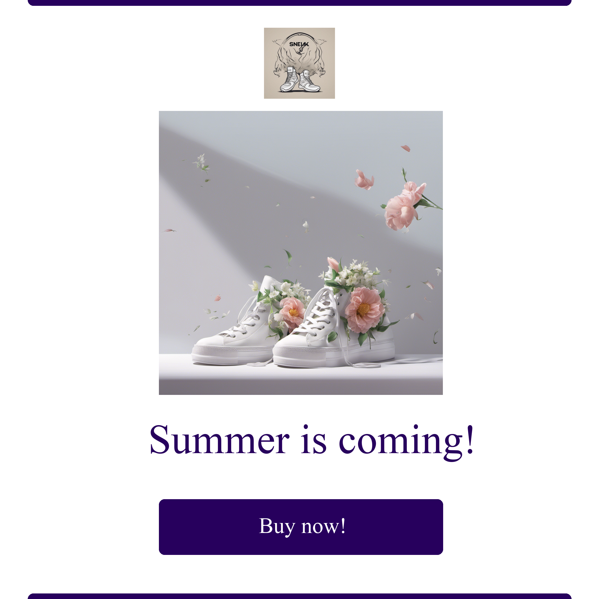

# Generate Advertisement Images

Generate cool images for your advertisement campaign. You can make a creative touch to your product and also combine it with your brand logo. Examples are given below for you to get inspired, then you can use the API to generate your own. Enjoy!   

## Examples
### Example 1 - Sneakers

Parameter | Value | Description
--- | --- | ---
base_image |  | Base image for the prompt
prompt | sneakers covered with flowers | Prompt for the recreation
color | #27005D | Color for the template
punchline | Summer is coming! | Punchline for the advertisement
button_text | Buy now! | Text for the button
logo |  | Logo for the brand

### Output




### Example 2 - Coffee

Parameter | Value | Description
--- | --- | ---
base_image |  | Base image for the prompt
prompt | sneakers covered with flowers | Prompt for the recreation
color | #27005D | Color for the template
punchline | Summer is coming! | Punchline for the advertisement
button_text | Buy now! | Text for the button
logo |  | Logo for the brand

### Output


```
pip install pipreqs
pipreqs /path/to/project
```